# aidrelay

[](LICENSE)

A Windows desktop app for managing MCP server configs and AI coding rules across multiple AI dev tools. Instead of manually editing JSON and markdown files for each tool, you keep everything in one place and sync it out.

Works with Cursor, VS Code, Claude Desktop, Windsurf, Zed, JetBrains IDEs, Claude Code, and Codex.

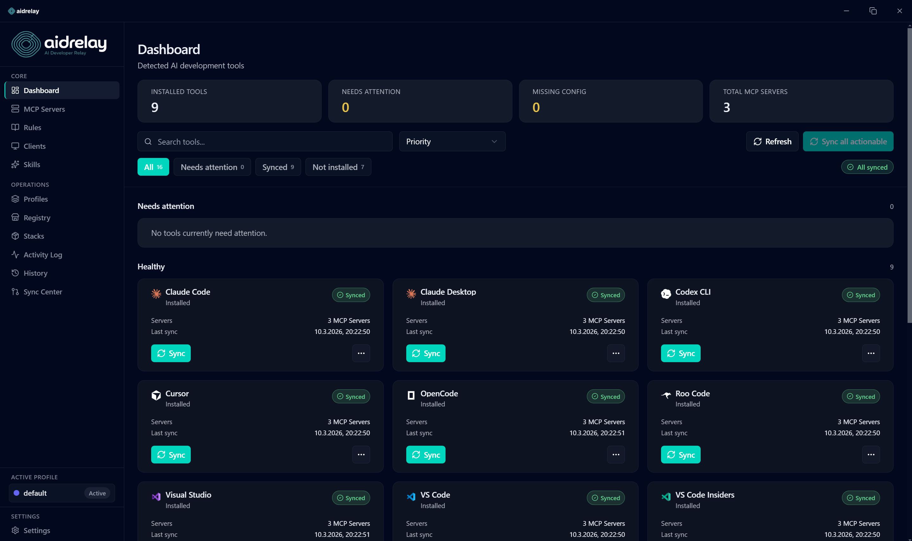

## Why

If you use more than one AI coding tool, you've probably run into this: you set up an MCP server in Cursor, then need the same thing in VS Code, then Claude Desktop wants a slightly different config format. Rules files are scattered across projects. Secrets end up in plaintext JSON. And when you switch machines, you get to do it all over again.

aidrelay gives you a single dashboard to manage all of it - servers, rules, skills, profiles - and sync changes to each tool's config format automatically.

## Features

**Servers** - add, edit, test, and toggle MCP servers from one table. A matrix view lets you control which servers go to which clients. You can import servers from existing client configs or install from Smithery / the official MCP registry.

**Rules** - write and manage AI rules with a markdown editor, organize by category and scope (global vs project), and track token usage. Rules sync to each client's expected format.

**Skills** - browse curated skills, install with conflict detection, or create your own. Installed skills can be edited, toggled, or removed.

**Profiles** - group servers and rules into named profiles for different workflows or projects, then switch between them.

**Sync** - preview what will change before writing anything. The sync center shows pending setup items, conflicts between local and remote state, and outgoing changes for review. Backups are created automatically before every write.

**Git sync** - connect a GitHub repo (OAuth or manual remote) to keep your setup in sync across machines. Push, pull, and resolve conflicts from settings.

**History** - filter and inspect backup history across clients, restore older snapshots, and review a full activity log.

**Stacks** - export your server + rule setup as a portable bundle, or import one to bootstrap a new machine.

**Security** - secrets are stored in Windows Credential Manager via keytar, not in plaintext config files. Everything runs locally with SQLite - no accounts, no cloud dependency.

## Screenshots

**Dashboard** - overview of all detected AI tools with sync status, server counts, and quick actions.


**Clients** - full list of supported tools with config paths, sync state, and per-client actions.
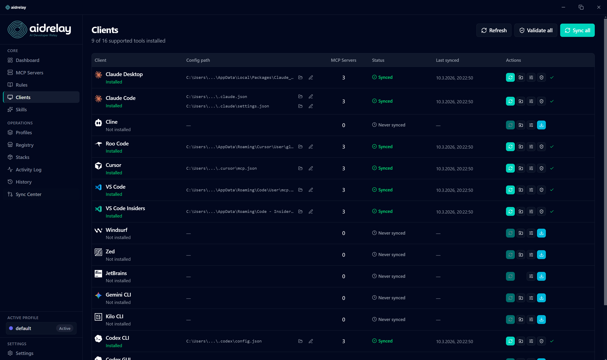

**Servers** - server list with type, command, and tags. The matrix below controls which servers get synced to which clients.
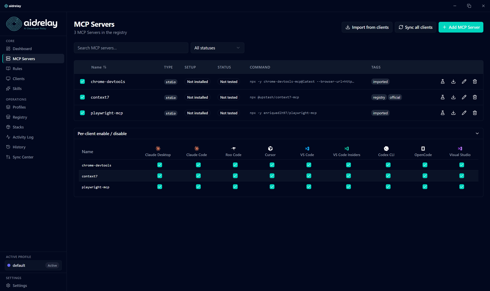

**Rules** - markdown-based rule editor with category filters, scope toggle, and a token budget breakdown per client.
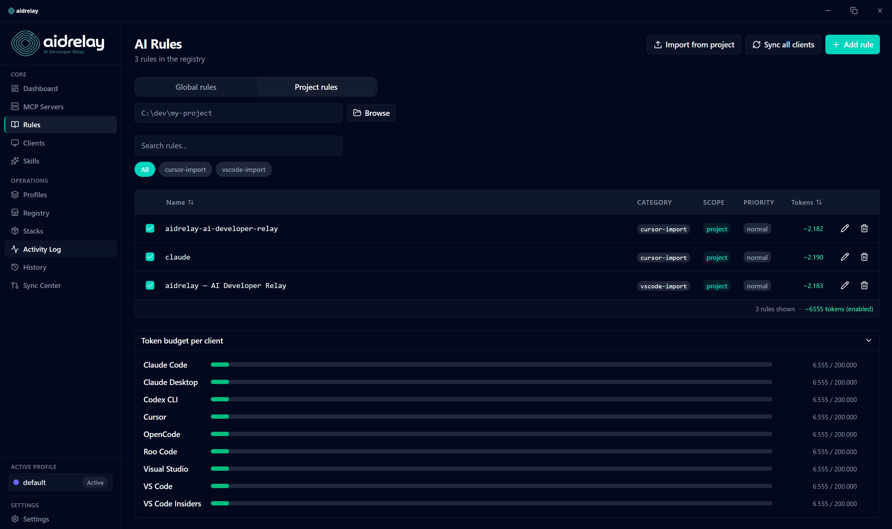

**Skills - discover** - browse and install curated skills from the community catalog.
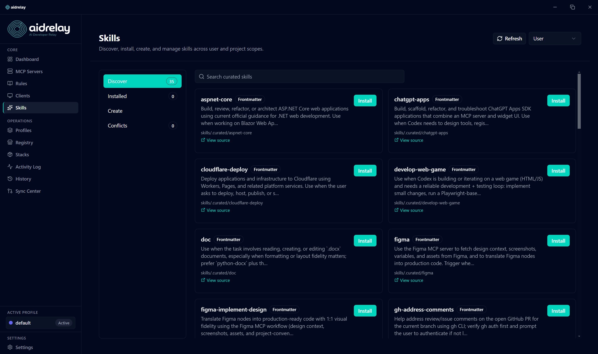

**Skills - installed** - manage installed skills with enable/disable, edit, reveal, and delete.
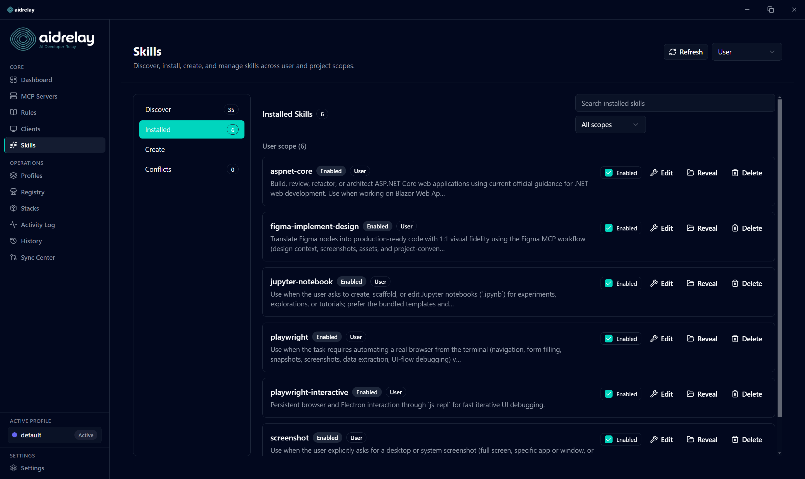

**Skills - edit** - inline skill file editor with frontmatter and markdown content.
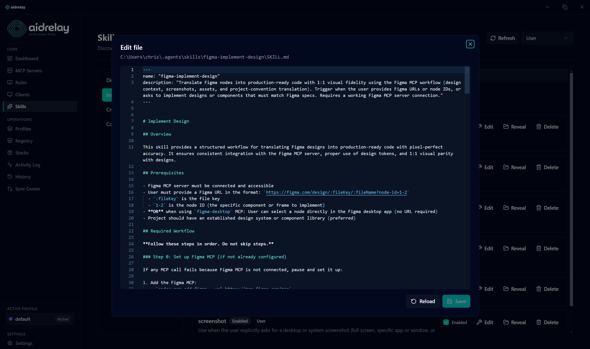

**Registry** - search Smithery and the official MCP registry, then install servers directly.
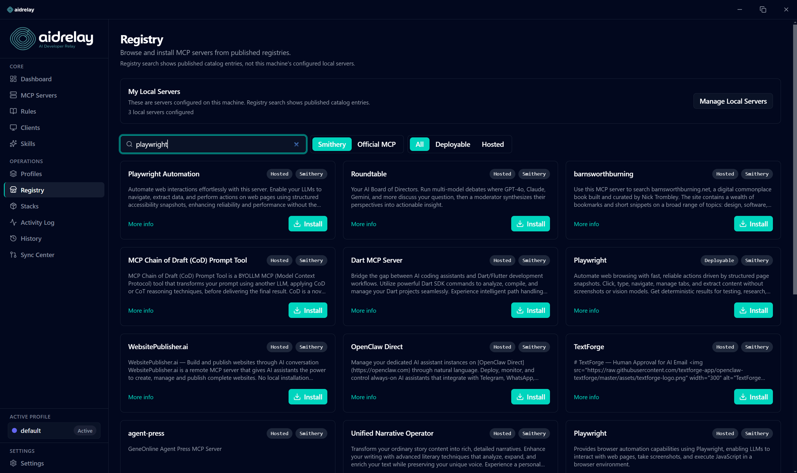

**Profiles** - named configurations for different contexts. Pick an icon, colour, and inherit from other profiles.
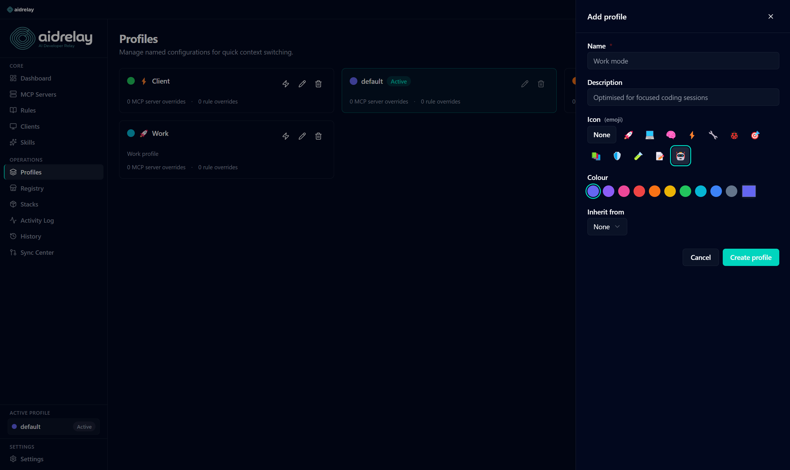

**Backup history** - per-client config snapshots with one-click restore. Filter by preflight, sync, or manual backups.
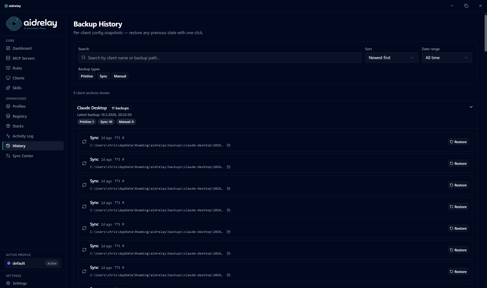

**Activity log** - filterable log of every sync, server change, rule update, and profile switch.
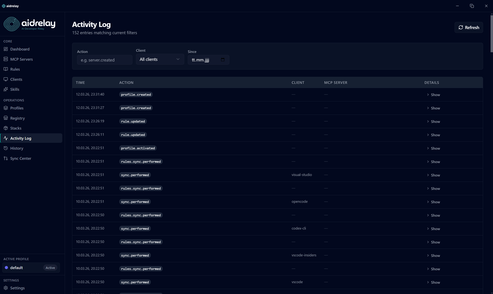

**Stacks** - export servers and rules as a portable JSON bundle, or import one from file or clipboard.
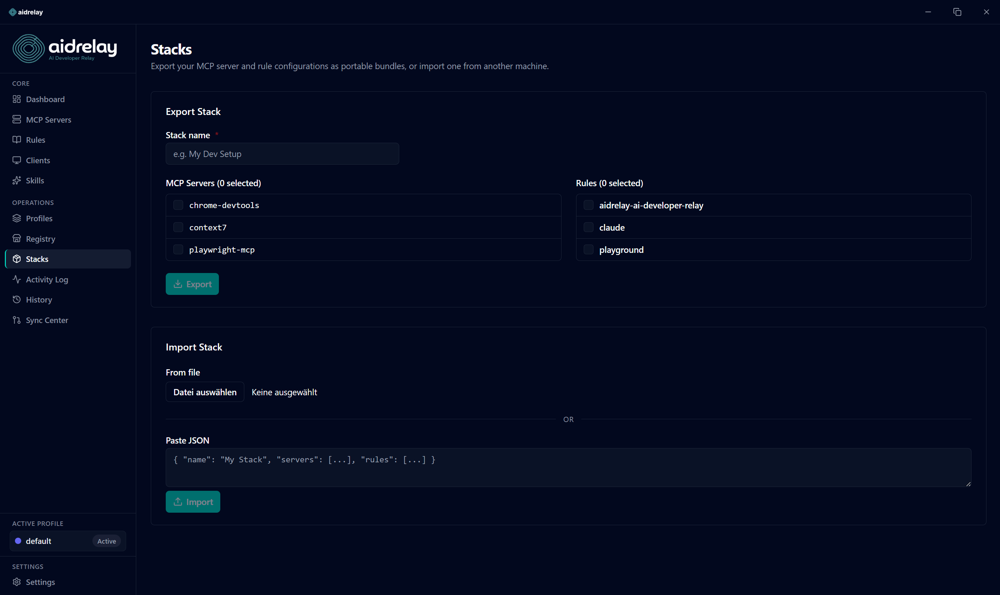

## Getting started

### Prerequisites

- Node.js >= 20
- pnpm >= 9
- Windows 10/11

### Setup

```bash
git clone https://github.com/Cyneric/aidrelay.git
cd aidrelay
pnpm install
pnpm dev
```

### Environment variables

Copy `.env.example` to `.env` and fill in your GitHub OAuth credentials if you want the git sync feature:

```bash
VITE_GITHUB_CLIENT_ID=your-client-id
VITE_GITHUB_CLIENT_SECRET=your-client-secret
```

Register an OAuth App at https://github.com/settings/developers with `http://localhost` as the callback URL. Without these, git sync won't be available but everything else works fine.

### Scripts

| Command | What it does |
| --- | --- |
| `pnpm dev` | Start the app in dev mode with HMR |
| `pnpm build` | Build all bundles (main, preload, renderer) |
| `pnpm dist:win` | Package a Windows installer |
| `pnpm typecheck` | TypeScript checks across all targets |
| `pnpm lint` | ESLint |
| `pnpm test` | Vitest test suite |
| `pnpm test:watch` | Vitest in watch mode |

### Project layout

```
src/
  main/             Electron main process
    clients/        Client adapters (one per AI tool)
    db/             SQLite repos and migrations
    git-sync/       isomorphic-git integration
    ipc/            IPC handlers
    registry/       Registry API clients (Smithery, MCP)
    rules/          Rule sync and format conversion
    secrets/        Keytar wrapper
    sync/           Sync orchestration, backups, file watching
    testing/        MCP server connection testing
    tray/           System tray
    updater/        Auto-update
  preload/          Typed contextBridge API
  renderer/         React UI
    components/     UI components by domain
    i18n/           Translations (en, de)
    pages/          Route pages
    stores/         Zustand stores
  shared/           Shared types and IPC contracts
```

## Tech stack

| | |
| --- | --- |
| Base | Electron 34+, electron-vite |
| Frontend | React 19, TypeScript, Tailwind CSS 4, shadcn/ui |
| State | Zustand |
| Routing | TanStack Router |
| Tables | TanStack Table |
| Forms | React Hook Form + Zod |
| Code editing | Monaco Editor |
| Markdown | @uiw/react-md-editor |
| Database | better-sqlite3 |
| Secrets | keytar (Windows Credential Manager) |
| Git | isomorphic-git |
| i18n | i18next + react-i18next |
| Packaging | electron-builder (NSIS) |
| Updates | electron-updater via GitHub Releases |

## Contributing

Contributions are welcome. For bigger changes, open an issue first so we can discuss the approach.

## License

MIT - see [LICENSE](LICENSE).
